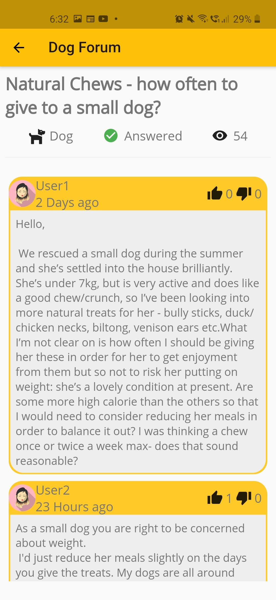

# 🐶 Paw-Pets are awesome! - InOut 7.0

<!-- TABLE OF CONTENTS -->

## Table of Contents

- [About the Project](#about-the-project)
- [Problem Statement](#Problem-Statement)
- [Features](#features)
- [Database Schema](#Database-Schema)
- [Team](#team)

<!-- ABOUT THE PROJECT -->

## About The Project

<b>PAW</b> is a Flutter app for managing pet essentails for owners.

## Problem Statement

In the current scenario many new generation pet owners or pet parents, treat their pets as their children. Pet care has certainly evolved now, mirroring the baby care category. Pet parents are concerned about maintaining the hygiene and health of their pets. So, right from vaccinations to grooming and food and nutrition to entertainment, everything is very important for pet parents.

There are many reasons for the boom in adoption like rapid urbanization, coupled with rising disposable incomes and a shift to nuclear families, which is driving more people to get pets. Another factor is the trend of the humanization of pets. Years ago a dog used to be treated as a guardian and stood outside the house. That is changing, especially in cities: the dog is now a companion animal and a member of the household. Many younger couples are increasingly adopting a pet be it a dog, cat, fish, and other animals like rabbits, hamsters, etc.

There are a lot of stray animals that can be put up for adoption but there's no such platform that matches these animals with potential pet parents. A lot of NGOs are working towards this and people who post about such animals on social media but the process can be simplified by PAW, an app where people can post about these animals.

<!-- FEATURES -->

## Screenshots

<pre>
     

</pre>

## Features

PAW aims to solve:

- Dedicated dashboard to keep track of the health of your pet.
- Option to add multiple pets
- Find a mate: A tinder-like match finder where owners can find a mate for their pet.
- Adopt a pet: Find animals to adopt
- QR code for pets(cats, dogs) so when they are lost anyone can scan the code and get info about the pet and its owner
- Option to report the lost animal.
- Hire daycare or individual caretakers
- Find a vet nearby or book an online consultation session
- Online store for food & other grooming products
- Forum to discuss about your pets needs- category tags.

<!-- DATABASE SCHEMA -->

## Database Schema

| collections            | documents  | collection           | document  | collection | document  |
| ---------------------- | ---------- | -------------------- | --------- | ---------- | --------- |
| users                  | userId     | pets                 | petId     |
| users                  | userId     | dashBoard            |
| mates                  | petId      | matches/chats chatId |
| adoption               | petId      |
| Store/products         | productId  |
| Store/categories       | categoryId |
| vets                   | vetId      |
| consultation           | docterIds  |
| Forums(Reddit threads) | postId     | comment              | commentId | comment    | commentId |
| hire                   | dummyId    | centers              |
| hire                   | dummyId    | individuals          |
| Events/Meetups         | eventId    |
| Lost/Found             | caseId     |

**Resources**

- [Pet Ui](https://www.youtube.com/watch?v=Cg9vLhfvWBE&ab_channel=TheGrowingDeveloper)
- [StateNotifier](https://www.youtube.com/watch?v=nUF0IrEjWj0&ab_channel=RobertBrunhage)
- [Riverpod](https://www.youtube.com/watch?v=GVspNESSess&t=1s&ab_channel=RobertBrunhage)
- [Hooks](https://www.youtube.com/watch?v=A1DUBgIsCv8&ab_channel=RobertBrunhage)
- [Freezed](https://www.youtube.com/watch?v=3HY6uFewwi4&t=921s&ab_channel=LearnFlutterCode)

**Structure**

```
lib
│   ├── models
│   │   ├── common
│   │   ├── forum
│   │   ├── pet
│   │   ├── store
│   │   └── user
│   ├── providers
│   ├── router
│   ├── services
│   ├── ui
│   │   ├── adoption
│   │   ├── auth
│   │   ├── dashboard
│   │   ├── drawer
│   │   ├── forum
│   │   ├── home
│   │   ├── lost
│   │   ├── mate
│   │   ├── messaging
│   │   ├── pets
│   │   ├── profile
│   │   ├── settings
│   │   ├── store
│   │   └── vet
│   ├── utils
│   └── widgets
└── test

2747 directories
sameerkashyap@Sameers-MacBook-Pro petme % cd lib
sameerkashyap@Sameers-MacBook-Pro lib % tree -d
.
├── models
│   ├── common
│   ├── forum
│   ├── pet
│   ├── store
│   └── user
├── providers
├── router
├── services
├── ui
│   ├── adoption
│   ├── auth
│   ├── dashboard
│   ├── drawer
│   ├── forum
│   ├── home
│   ├── lost
│   ├── mate
│   ├── messaging
│   ├── pets
│   ├── profile
│   ├── settings
│   ├── store
│   └── vet
├── utils
└── widgets
```

<!-- GETTING STARTED -->

**Task List**

| sl no. | Task                                    | Assignee | Progress |
| ------ | --------------------------------------- | -------- | -------- |
| 1      | Set up firebase                         | Akhil    | Yes      |
| 2      | Database Design                         | Sameer   | Yes      |
| 3      | UI Design                               | Vanshika | Yes      |
| 4      | DashBoard                               | Akanksha | Yes      |
| 5      | find a Mate                             | Akhil    | Yes      |
| 6      | Adopt don't shop                        | Vamsi    | Yes      |
| 7      | Discussions                             | Vamsi    | Yes      |
| 8      | Store                                   | Akanksha | Yes      |
| 9      | Lost and found                          | Akanksha | Yes      |
| 10     | Authentication with firebase            | Sameer   | Yes      |
| 11     | Vet and Consultation                    | Akhil    | Yes      |
| 12     | For Hire                                | Akhil    | Yes      |
| 13     | Train your pets, Health tips and tricks | Akanksha | Yes      |
| 14     | Auth View                               | Sameer   | Yes      |
| 15     | Drawer, Profile View                    | Sameer   | Yes      |
| 16     | My Pets                                 | Sameer   | Yes      |

## Team:

| S.No. | Team Member Name | GitHub Username                                        |
| ----- | ---------------- | ------------------------------------------------------ |
| 1.    | Sameer Kashyap   | [@Sameerkash](https://github.com/Sameerkash)           |
| 2.    | Akanksha Singh   | [@Akanksha1212](https://github.com/Akanksha1212)       |
| 3.    | Vanshika Garg    | [@Vanshikagarg17](https://github.com/Vanshikagarg17)   |
| 4.    | Akhil Pasumarthi | [@akhilpasumarthi](https://github.com/akhilpasumarthi) |
| 5.    | Vamsidhar Reddy  | [@vamsidhar1999](https://github.com/vamsidhar1999)     |
